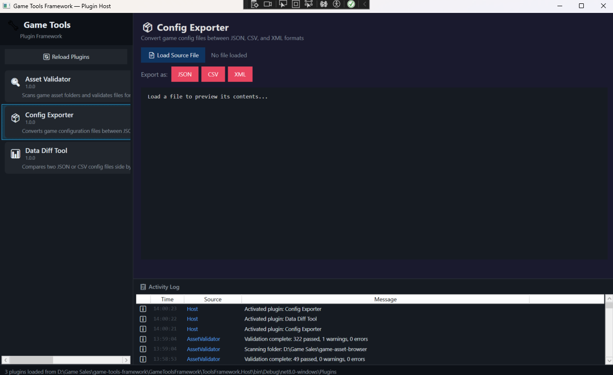
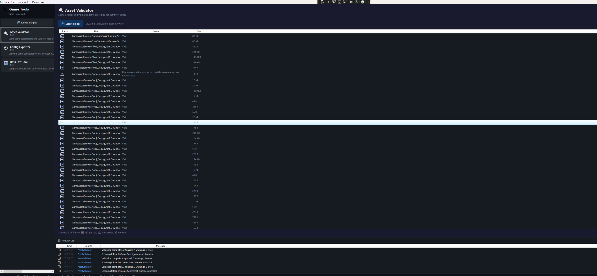

# GAME TOOLS FRAMEWORK - PLUGIN ARCHITECTURE

An extensible WPF game tools framework with a plugin architecture where tools are discovered and loaded dynamically at runtime from DLL files. Built with dependency injection, SOLID principles and shared service contracts. Includes 3 sample plugins: Asset Validator, Data Diff Tool and Config Exporter.



## PROJECT OVERVIEW

Real game studio tools teams don't build monolithic applications, they build extensible frameworks that teams can extend with their own plugins. This project implements that pattern:

- **Host Application** - a WPF shell that provides plugin hosting, shared services (logging, file dialogs) and a unified UI
- **Plugin SDK** - a shared contract library defining the `IPlugin` interface and service abstractions
- **3 Sample Plugins** - each is a separate DLL that the host discovers and loads at runtime with zero compile-time coupling

Adding a new tool is as simple as building a DLL that implements `IPlugin` and dropping it in the Plugins folder.

## ARCHITECTURE

```
┌──────────────────────────────────────────────┐
│         HOST APPLICATION (WPF Shell)         │
│                                              │
│  ┌─────────────┐  ┌──────────────────────┐   │
│  │ Plugin List │  │  Plugin Content Area │   │
│  │ (Sidebar)   │  │  (Dynamic UserCtrl)  │   │
│  └──────┬──────┘  └──────────┬───────────┘   │
│         │                    │               │
│  ┌──────┴────────────────────┴───────────┐   │
│  │         PluginLoader (Reflection)     │   │
│  │  - Scans /Plugins folder for DLLs     │   │
│  │  - Finds IPlugin implementations      │   │
│  │  - Creates instances + initializes    │   │
│  └──────────────────┬────────────────────┘   │
│                     │                        │
│  ┌──────────────────┴────────────────────┐   │
│  │      Dependency Injection Container   │   │
│  │  - ILogService -> LogService          │   │
│  │  - IFileDialogService -> FileDialog   │   │
│  └───────────────────────────────────────┘   │
│                     │                        |
│              Activity Log Panel              │
└─────────────────────┼────────────────────────┘
                      │ IServiceProvider
    ┌─────────────────┼─────────────────┐
    │                 │                 │
┌───┴───┐       ┌─────┴───┐       ┌─────┴────┐
│Plugin │       │ Plugin  │       │ Plugin   │
│Asset  │       │  Data   │       │ Config   │
│Valid. │       │  Diff   │       │ Exporter │
└───┬───┘       └────┬────┘       └─────┬────┘
    │                │                  │
    └────────────────┴──────────────────┘
                     │
          ┌──────────┴──────────┐
          │   ToolsFramework.SDK│
          │   (Shared Contract) │
          │   - IPlugin         │
          │   - ILogService     │
          │   - IFileDialogSvc  │
          └─────────────────────┘
```

## THE THREE PLUGINS

### Asset Validator
Scans a game asset folder and validates files for common issues:
- Empty files (0 bytes)
- Oversized files (>100MB)
- Naming convention violations (spaces, special characters)
- Corrupted PNG headers
- Invalid JSON syntax



### Data Diff Tool
Compares two JSON or CSV config files side-by-side:
- Highlights added, removed, and modified fields
- Color-coded diff view (red = old, green = new)
- Works with both flat JSON objects and CSV row comparisons
- Summary statistics (added/removed/modified/unchanged counts)

### Config Exporter
Converts game configuration files between formats:
- Supports JSON -> CSV, JSON -> XML, CSV -> JSON, XML -> JSON
- Live preview of converted output
- File dialog for save-as export
- Handles nested structures and arrays

## KEY DESIGN PATTERNS

### Plugin Architecture (Runtime Discovery)
The `PluginLoader` uses **reflection** to scan DLL files, find classes implementing `IPlugin` and instantiate them at runtime. The host has zero compile-time knowledge of specific plugins.

### Dependency Injection
Services are registered in a DI container (`Microsoft.Extensions.DependencyInjection`) and injected into plugins via `IServiceProvider`. Plugins depend on abstractions (interfaces), not implementations.

### Interface Segregation (SOLID)
- `IPlugin` - the minimal contract every plugin must satisfy
- `ILogService` - logging abstraction (plugins log, host decides where)
- `IFileDialogService` - file dialog abstraction (plugins request files, host shows dialogs)

### Shared SDK Contract
The `ToolsFramework.SDK` library is the only dependency shared between host and plugins. This means plugins can be built by different teams, at different times, without touching the host code.

## TOOLS AND TECHNOLOGIES

- **C# / .NET 8.0** - application framework
- **WPF / XAML** - host shell UI
- **Microsoft.Extensions.DependencyInjection** - DI container
- **System.Reflection** - runtime plugin discovery and loading
- **Newtonsoft.Json** - JSON parsing for Data Diff and Config Exporter
- **Multi-project solution** - 5 projects with clean separation

### Design Patterns Demonstrated
- Plugin / Extension pattern
- Dependency Injection / Inversion of Control
- Interface Segregation Principle
- Factory pattern (plugin instantiation)
- Observer pattern (log event notifications)

## PROJECT STRUCTURE

```
game-tools-framework/
├── ToolsFramework.SDK/              # Shared plugin contract
│   ├── Interfaces/
│   │   ├── IPlugin.cs               # Core plugin interface
│   │   ├── ILogService.cs           # Logging abstraction
│   │   └── IFileDialogService.cs    # File dialog abstraction
│   └── Services/
│       └── LogService.cs            # Default log implementation
├── ToolsFramework.Host/             # WPF host application
│   ├── Services/
│   │   ├── PluginLoader.cs          # Reflection-based plugin discovery
│   │   └── FileDialogService.cs     # WPF file dialog implementation
│   ├── ViewModels/
│   │   └── HostViewModel.cs         # Host shell logic
│   ├── Commands/
│   │   └── RelayCommand.cs
│   ├── MainWindow.xaml              # Host shell UI
│   └── MainWindow.xaml.cs
├── Plugin.AssetValidator/           # Plugin - file validation tool
├── Plugin.DataDiff/                 # Plugin - JSON/CSV comparison tool
├── Plugin.ConfigExporter/           # Plugin - format conversion tool
└── images/
```

## GETTING STARTED

### Prerequisites
- Windows 10/11
- .NET 8.0 SDK
- Visual Studio 2022

### Build & Run
```bash
git clone https://github.com/rush2pranav/game-tools-framework.git

# Open GameToolsFramework.sln in Visual Studio
# Set ToolsFramework.Host as startup project
# Build -> Rebuild Solution (this copies plugin DLLs to the Plugins folder)
# Press F5
```

### Adding a New Plugin
1. Create a new Class Library project targeting `net8.0-windows` with `<UseWPF>true</UseWPF>`
2. Reference `ToolsFramework.SDK`
3. Create a class implementing `IPlugin`
4. Build the DLL into the Host's `Plugins/` folder
5. Run the host - your plugin appears automatically

## WHAT I LEARNED

- **Plugin architectures require strict contracts** The `IPlugin` interface is the most important design decision in the entire project. Every method signature becomes a permanent API that all plugins depend on and changing it means updating every plugin. This taught me why interface design deserves careful thought upfront.
- **Reflection is powerful but needs error handling** Loading arbitrary DLLs at runtime can fail in many ways like missing dependencies, type conflicts, initialization errors. Wrapping everything in try-catch with good logging is essential for a robust plugin system.
- **Dependency injection changes how you think about architecture** Instead of plugins creating their own file dialogs or loggers, they receive shared services through `IServiceProvider`. This keeps plugins lightweight and the host in control of implementation details.
- **The SDK project is the keystone** Having a separate shared library that both host and plugins reference (but that references neither of them) creates the clean separation that makes the plugin architecture work. Without it, you'd have circular dependencies.

## POTENTIAL EXTENSIONS

- Add plugin settings/configuration persistence
- Implement plugin dependency resolution (Plugin A requires Plugin B)
- Add a plugin marketplace / discovery UI
- Implement plugin sandboxing for security
- Add hot-reload (detect new DLLs without restarting the host)
- Build a Plugin Developer Kit with templates and documentation
- Add inter-plugin communication via a message bus